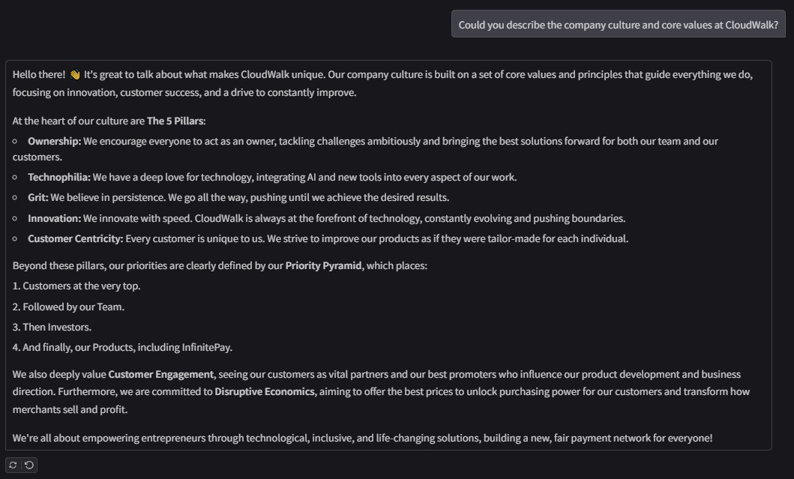
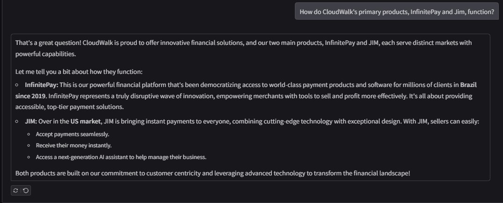
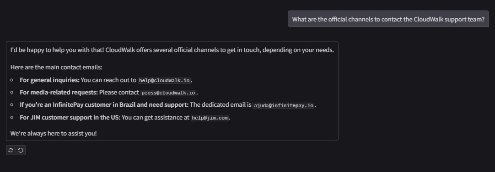

# CloudBot: A RAG Chatbot for CloudWalk

[](https://www.python.org/downloads/)
[](https://www.langchain.com/)
[](https://gradio.app/)
[](https://opensource.org/licenses/MIT)

CloudBot is a Retrieval-Augmented Generation (RAG) chatbot built to answer questions about CloudWalk's mission, culture, products (like InfinitePay and Jim), and brand values. It uses a local knowledge base sourced from public documents to provide accurate, context-aware responses through an interactive web interface.

This project was developed as part of the Fiat Lux challenge.

### Demo
### 💬 Sample Conversations






### ✨ Features

-   **Interactive Chat Interface:** A user-friendly web UI powered by Gradio.
-   **Retrieval-Augmented Generation (RAG):** Answers are based on a provided knowledge base, ensuring factual and contextually relevant responses.
-   **Local Knowledge Base:** Easily extendable by adding Markdown files to the `data/` directory.
-   **Powered by Google Gemini:** Utilizes Google's state-of-the-art models for language understanding and generation.

### 🛠️ Tech Stack

-   **Python**
-   **LangChain** for the RAG pipeline and orchestration.
-   **Google Gemini API** for the LLM and embedding models.
-   **FAISS** for efficient local vector storage and similarity search.
-   **Gradio** for building the interactive web interface.

### ⚙️ Setup and Installation

Follow these steps to set up and run the project locally.

1.  **Clone the repository:**
    ```bash
    git clone https://github.com/katincko/ChatBot-CloudWalk-Nimbus
    cd CloudBot
    ```

2.  **Create and activate a virtual environment:**
    ```bash
    # For Windows
    python -m venv venv
    venv\Scripts\activate

    # For macOS/Linux
    python3 -m venv venv
    source venv/bin/activate
    ```

3.  **Install dependencies:**
    ```bash
    pip install -r requirements.txt
    ```

4.  **Set up environment variables:**
    -   Create a file named `.env` in the root directory.
    -   Add your Google API key to the file:
        ```env
        GOOGLE_API_KEY="YOUR_API_KEY_HERE"
        ```

### 🚀 Usage

The project is divided into two main steps: data ingestion and running the chatbot.

1.  **Data Ingestion (Run this only once):**
    First, place your knowledge base documents (e.g., `.md` files) inside the `data/` folder. Then, run the ingestion script to create the vector store:
    ```bash
    python ingest.py
    ```
    This will process the documents and create a `vector_store/` directory containing the FAISS index.

2.  **Running the Chatbot:**
    To start the interactive Gradio interface, run:
    ```bash
    python bot.py
    ```
    Open your browser and navigate to the local URL provided in the terminal (usually `http://127.0.0.1:7860`).


### 📄 License

This project is licensed under the MIT License. See the `LICENSE` file for details.
